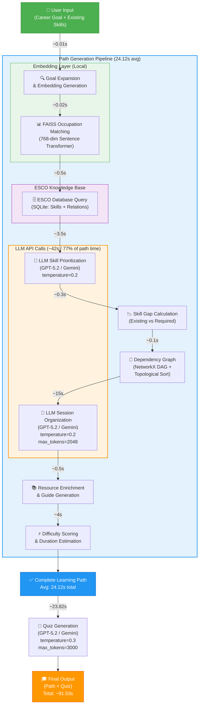

# Hybrid-GenMentor System Pipeline with Processing Times

## Pipeline Stage Breakdown

| Stage | Component | Time | % of Path |
|-------|-----------|------|-----------|
| 1 | Goal Expansion & Embedding | ~0.01s | <1% |
| 2 | FAISS Occupation Matching | ~0.02s | <1% |
| 3 | ESCO Database Query | ~0.5s | 2% |
| 4 | **LLM Skill Prioritization** | **~3.5s** | **15%** |
| 5 | Skill Gap Calculation | ~0.3s | 1% |
| 6 | Dependency Graph (NetworkX) | ~0.1s | <1% |
| 7 | **LLM Session Organization** | **~15s** | **62%** |
| 8 | Resource Enrichment | ~0.5s | 2% |
| 9 | Difficulty Scoring | ~4s | 17% |
| **Total Path Generation** | | **24.12s** | **100%** |
| **Quiz Generation** | | **23.82s** | — |
| **Other (overhead)** | | **43.59s** | — |
| **Total per test case** | | **91.53s** | — |
